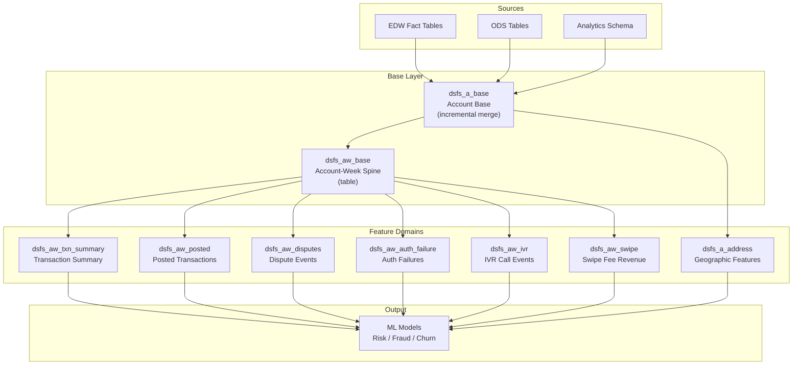

# DS Feature Store

## Summary

Production ML feature store serving weekly behavioral features across 8+ domains — transactions, disputes, authorization failures, IVR calls, swipe fees, and more. Built on an **account-week spine architecture** with 1/5/10-week rolling window aggregations. Powers risk scoring, fraud detection, and churn prediction models.

## My Role: Co-built

Helped design and build the feature store infrastructure, including the account-week spine, domain-specific feature models, and the centralized date macro system. Collaborated with the Data Science team to define feature requirements and ensure ML-ready output.

## Why This Matters

Feature stores are the bridge between raw data and ML models. Most data scientists work with pre-built features. I helped **build the feature store** that serves production ML models across risk, fraud, and customer lifecycle.

## Architecture

## Feature Domains

| Domain | Model | Key Features | ML Use Case |
|--------|-------|-------------|-------------|
| **Transactions** | `dsfs_aw_txn_summary` | DD amounts, GDV, reload, ACH, active days | Churn prediction, engagement scoring |
| **Posted Txns** | `dsfs_aw_posted` | Purchase amounts, ATM, fees, liquid/non-liquid, crypto | Spending behavior, risk scoring |
| **Disputes** | `dsfs_aw_disputes` | Claim counts, fraud/non-fraud, granted ratios | Fraud risk, loss prediction |
| **Auth Failures** | `dsfs_aw_auth_failure` | Failure counts, suspected fraud, last success | Fraud detection, risk models |
| **IVR Calls** | `dsfs_aw_ivr` | Call counts by type, authorization tracking | Customer support prediction |
| **Swipe Fees** | `dsfs_aw_swipe` | Fee amounts, revenue portions | Revenue modeling |
| **Address** | `dsfs_a_address` | City, state, geographic features | Geo-based risk models |

## Key Technical Decisions

1. **Account-week spine ensures consistency** — All feature domains share identical time windows. No missing weeks, no alignment bugs.
2. **Rolling windows (1w, 5w, 10w)** — Short/medium/long-term behavioral patterns. Critical for ML feature diversity.
3. **Centralized date macro** — `get_feature_store_dates()` ensures identical date boundaries. Prevents training/serving skew.
4. **Incremental merge strategy** — Handles late-arriving data without full rebuilds. Essential for weekly retraining.
5. **Lifetime vs windowed separation** — Lifetime metrics in dedicated models for query performance.

## Impact

- **Serves production ML models** for risk, fraud, and customer lifecycle prediction
- **8+ feature domains** with 100+ individual features
- **Consistent spine architecture** eliminates feature alignment bugs
- **Weekly incremental refresh** supports model retraining without expensive full rebuilds

## Detailed Documentation

- [Architecture Deep Dive](architecture.md)
- [Model Catalog](model-catalog.md)
- [Feature Domains](feature-domains.md)
- [Technical Patterns](technical-patterns.md)
- [LLM Context](llm-context.md)
