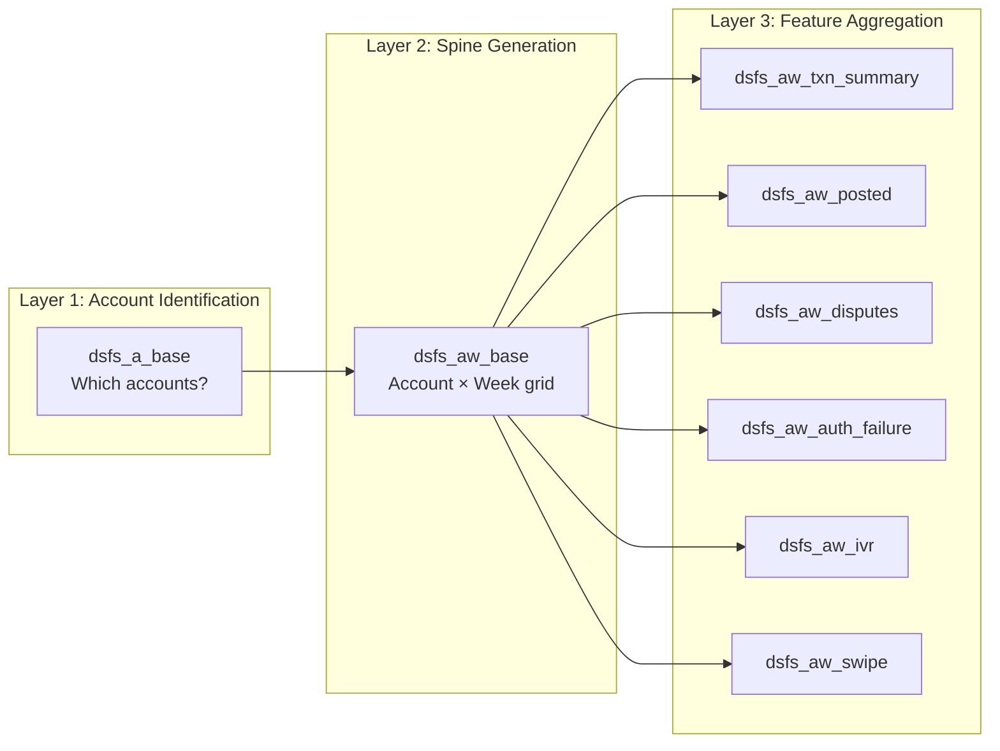
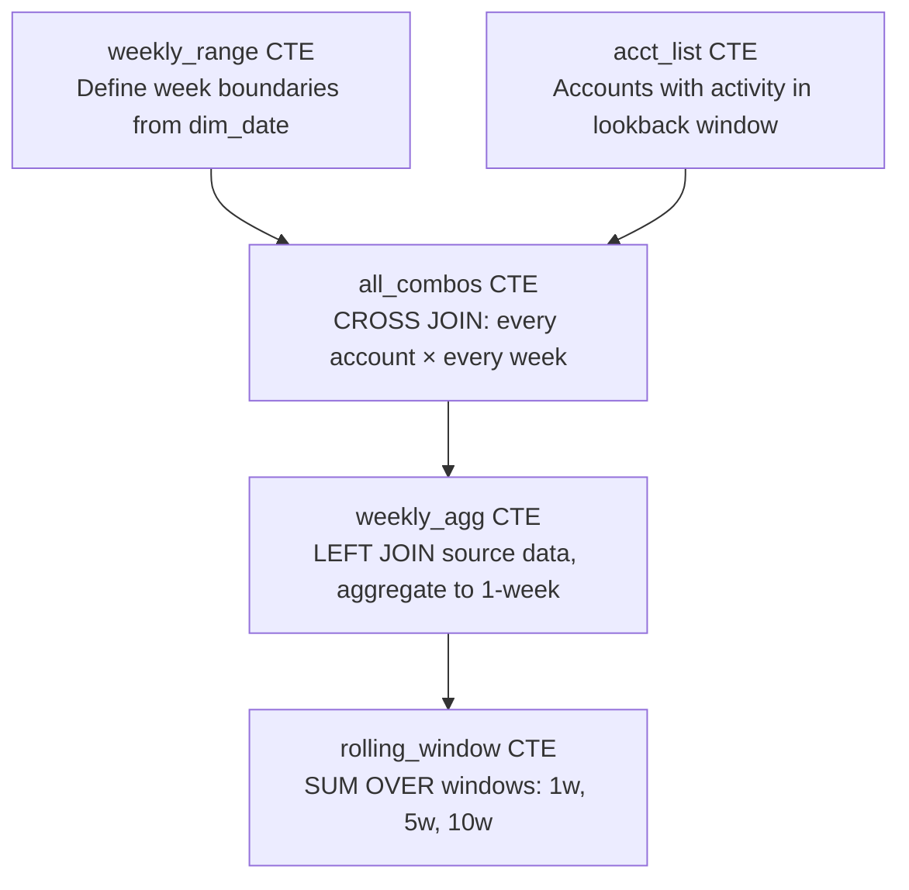
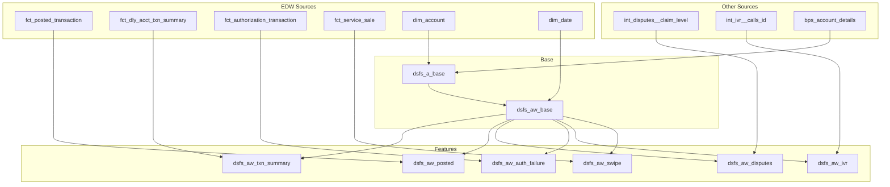

# Feature Store — Architecture

## Pipeline Overview

The feature store follows a three-layer architecture designed for ML consumption:



## Layer 1: Account Identification (`dsfs_a_base`)

**Purpose**: Define the universe of accounts eligible for feature generation.

**Logic**:
- Start with `dim_account` — all accounts in the system
- Inner join to accounts with active transactions in the last 365 days
- Enrich with product/division metadata from multiple dimension tables
- Apply business filters:
  - Status = Normal only
  - Business divisions: BaaS, Direct, Retail
  - Exclude legacy/deprecated brands

**Materialization**: Incremental merge on `acct_uid` — only processes accounts with updates since last run.

## Layer 2: Spine Generation (`dsfs_aw_base`)

**Purpose**: Create a complete account × week grid so every feature domain has consistent time windows.

**Why a spine matters for ML**:
- Without a spine, missing weeks appear as NULLs → requires imputation downstream
- With a spine, missing activity explicitly becomes zeros → cleaner features
- All domains align on the same week boundaries → no temporal misalignment

**Week Key Convention**:
```
week_key = DATEDIFF(week, '2023-12-31', calendar_date)
```

This produces a monotonically increasing integer, making it easy to compute rolling windows:
- 1-week window: `WHERE week_key BETWEEN current_week - 1 AND current_week`
- 5-week window: `WHERE week_key BETWEEN current_week - 5 AND current_week`
- 10-week window: `WHERE week_key BETWEEN current_week - 10 AND current_week`

**Composite Key**:
```
acct_uid_week_key = CAST(acct_uid AS VARCHAR) || '_' || CAST(week_key AS VARCHAR)
```

## Layer 3: Feature Aggregation (`dsfs_aw_*`)

Every feature domain model follows the same CTE pattern:



**Key design decisions:**
- **CROSS JOIN** ensures every account gets a row for every week (even inactive weeks)
- **LEFT JOIN** to source data means inactive weeks get COALESCE'd to 0
- **Window functions** compute rolling aggregations efficiently in a single pass

## Date Parameter System

All feature models use the same centralized macro:

```
get_feature_store_dates() → {
    start_date:           configurable start
    end_date:             configurable end
    look_back_start_date: end_date - 10 weeks (for rolling windows)
}
```

This ensures:
- All domains cover the same date range
- No training/serving skew from misaligned date boundaries
- Easy to reconfigure for backfills or date range changes

## Data Flow Diagram


