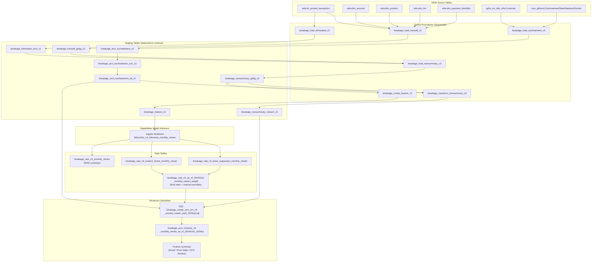

# Data Pipeline

## 01. Pipeline Overview

All tables reside in the `datascience` schema on Redshift.

---

## 02. Source Tables (EDW)

| Table | Description |
|-------|-------------|
| `edw.fct_posted_transaction` | Posted transactions with amount, credit/debit indicator, timestamps |
| `edw.dim_account` | Account dimension with `acct_uid`, `sor_acct_id` |
| `edw.dim_product` | Product dimension; `product_type_uid = 3` = Gift Card |
| `edw.dim_bin` | BIN dimension; `bank_uid <> 7` excludes GE remains |
| `edw.dim_payment_identifier` | Payment identifier linking accounts to BINs |
| `gdot_src_dbo_infa.Customer` | Customer registration data (name, address, state, balance) |
| `gdot_src_dbo_infa.vuProduct` | Product lookup (`OurCardType = 'Gift Card'`) |
| `public.myu_giftcard_EscheatmentStateStatutoryPeriods` | State escheatment rules (period in years by state) |

---

## 03. Stored Procedures

### 03a. `breakage_load_transdtl_v3(start_date, end_date, OUT status)`

**Purpose:** Extract gift card transaction details from EDW for the reporting period.

**Source:** `edw.fct_posted_transaction` joined with `dim_account`, `dim_product`, `dim_bin`, `dim_payment_identifier`

**Target:** `datascience.breakage_transdtl_gdbg_v2`

**Key filters:**
- `product_type_uid = 3` (Gift Card)
- `bank_uid <> 7` (Exclude GE remains)
- Uses `max(pymt_identifier_uid)` per account to deduplicate

**Output columns:**
| Column | Description |
|--------|-------------|
| `account` | `acct_uid` from EDW |
| `accttype` | `'variable'` or `'fixed'` based on product name |
| `recordtype` | `'I'` (initial load), `'R'` (reload), `'T'` (transaction) |
| `creditdebit` | `'C'` or `'D'` |
| `postdate` | `posted_dttm_pt` |
| `transamt` | `total_post_amt` |

---

### 03b. `breakage_load_eliminated_v2(start_date, end_date, OUT status)`

**Purpose:** Identify accounts where total debits exceed total credits (net loss accounts). These accounts are excluded from breakage calculations.

**Source:** `edw.fct_posted_transaction` for accounts with initial loads (`creditdebit = 'C'` and `recordtype = 'I'`)

**Target:** `datascience.breakage_eliminated_acct_v2`

**Logic:** `HAVING sum(credits) < sum(debits)` -- accounts where money out exceeds money in

---

### 03c. `breakage_load_escheatment_v3(start_date, end_date, OUT status)`

**Purpose:** Classify registered gift card accounts by state escheatment requirements.

**Source:** `gdot_src_dbo_infa.Customer` joined with escheatment state rules

**Target tables:**
| Table | Description |
|-------|-------------|
| `breakage_acct_escheatment_v2` | Full snapshot of all escheatable accounts |
| `breakage_acct_escheatment_curr_v2` | Newly identified escheatable accounts (not previously in `_all`) |
| `breakage_acct_escheatment_all_v2` | Historical cumulative list of all escheatable accounts |

**Escheatment percentages by state:**
| Percentage | States |
|-----------|--------|
| **60%** | MO, NJ, WV, NM, MT |
| **100%** | FL, GA, NY, OK, LA, MS, OR, NE, DE, AK, DC, NH |
| **0%** | All other states |

**Registration validation filters:**
- Must have a valid registered address (not the generic GDC addresses)
- Must have a valid registered name (not generic names like "Walmart Wal-Mart Gift Card", "GIFT CARD*RECIPIENT", etc.)
- Positive current balance
- Activated after 2012-10-01

---

### 03d. `breakage_load_transummary_v3(start_date, end_date, OUT status)`

**Purpose:** Create transaction summary joining initial loads with redemptions.

**Source:** `datascience.breakage_transdtl_gdbg_v2`

**Target:** `datascience.breakage_transummary_gdbg_v2`

**Key columns:**
| Column | Description |
|--------|-------------|
| `account` | Account identifier |
| `accttype` | `'variable'` or `'fixed'` |
| `loaddate` | Date of initial credit load |
| `loadamt` | Initial load amount |
| `redemptiondate` | Date of debit transaction (NULL if no redemption) |
| `redemptionamt` | Redemption amount |
| `load_to_redem` | Months elapsed between load and redemption |
| `createdate` | Processing timestamp |

**Logic:**
1. First insert: New loads with no redemption + new redemptions for existing load accounts
2. Second insert: Reload credits (non-initial load credits treated as negative redemptions)

**Exclusions:** Accounts in `breakage_eliminated_acct_v2` are excluded.

---

### 03e. `breakage_transform_transummary_v3(start_date, end_date, OUT status)`

**Purpose:** Enrich the transaction summary with escheatment flags and percentages.

**Source:** `datascience.breakage_transummary_gdbg_v2` left joined with `datascience.breakage_acct_escheatment_all_v2`

**Target:** `datascience.breakage_transummary_noesch_v2`

**Additional columns:**
| Column | Description |
|--------|-------------|
| `state` | Registered state (from escheatment table) |
| `escheatment_pct` | 0.0, 0.6, or 1.0 based on state |
| `escheatment_date` | Month when escheatment was identified |

---

### 03f. `breakage_create_feature_v3(start_date, end_date, OUT status)`

**Purpose:** Generate ML features -- cumulative redemption percentages at various elapsed-month milestones.

**Source:** `datascience.breakage_transummary_gdbg_v2`

**Target:** `datascience.breakage_feature_v3`

**Feature columns:**
| Column | Description |
|--------|-------------|
| `reportdate` | Report period |
| `loaddate` | Cohort load month |
| `year`, `month` | Load date components |
| `initial_load_amt` | Total initial load for the cohort |
| `to_month1_percent` ... `to_month12_percent` | Cumulative unredeemed % at months 1-12 |
| `to_month18_percent`, `to_month24_percent`, ... `to_month48_percent` | 6-month interval unredeemed % |
| `rate` | Current unredeemed % (all time) |
| `rate0` | Unredeemed % at 36 months |
| `rate1` | Unredeemed % at 48 months |
| `rate2` | Unredeemed % at 60 months (terminal) |

**Formula:** `unredeemed_pct = (1 - cumulative_redemption / initial_load) * 100`

---

## 04. Model Output Tables

| Table | Description | Grain |
|-------|-------------|-------|
| `breakage_rate_v3_monthly_retrain` | Combined (averaged) breakage rates | `reportdate` x `loaddate` |
| `breakage_rate_v3_linear_regression_monthly_retrain` | Linear regression model rates | `reportdate` x `loaddate` |
| `breakage_rate_v3_random_forest_monthly_retrain` | Random forest model rates | `reportdate` x `loaddate` |

**Columns:** `reportdate`, `loaddate`, `rate`, `rate_adjust`, `calculated_rate`, `createdate`

---

## 05. Rate Table (Final)

**Table:** `datascience.breakage_rate_v3_as_of_20240101_monthly_retrain_weight`

This is the authoritative rate table used for revenue calculation. It contains:
- Combined model rates (50/50 average)
- Manual overrides from Finance for specific cohorts
- `weight` column identifies the quarter (e.g., `'2024Q3'`)
- `rate_adjust` column shows MoM rate change

---

## 06. Revenue Table (Final)

**Table:** `datascience.breakage_acct_revenue_v5_monthly_retrain_as_of_20240101_2024q1`

| Column | Description |
|--------|-------------|
| `reportdate` | Reporting month |
| `loaddate` | Cohort load month |
| `account` | Account identifier |
| `accttype` | `'variable'` or `'fixed'` |
| `revtype` | Revenue classification (see below) |
| `redemamt` | Redemption amount |
| `load_to_redem` | Months elapsed |
| `load_amt` | Initial load amount |
| `revamt` | Revenue amount |
| `breakage_rate` | Applied breakage rate |
| `breakage_to_date` | `rate/100 * load_amt` |
| `redemption_to_date` | `(100 - rate)/100 * load_amt` |
| `redemption_rate` | `redemption_amt / redemption_to_date` |
| `escheatment_pct` | 0.0, 0.6, or 1.0 |
| `createdate` | Processing timestamp |

### Revenue Types (`revtype`)

| Value | Description |
|-------|-------------|
| `breakage` | Standard breakage revenue (open period, < 60 months) |
| `adjustment-reverse` | Revenue reversal for redemptions past terminal period (>= 60 months) |
| `adjustment-escheatment` | Revenue reversal for newly registered escheatable accounts |
| `adjustment-rate` | Delta between prior-period and current-period rate expectations |
