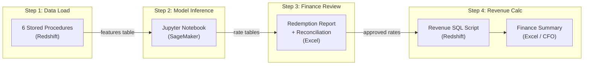
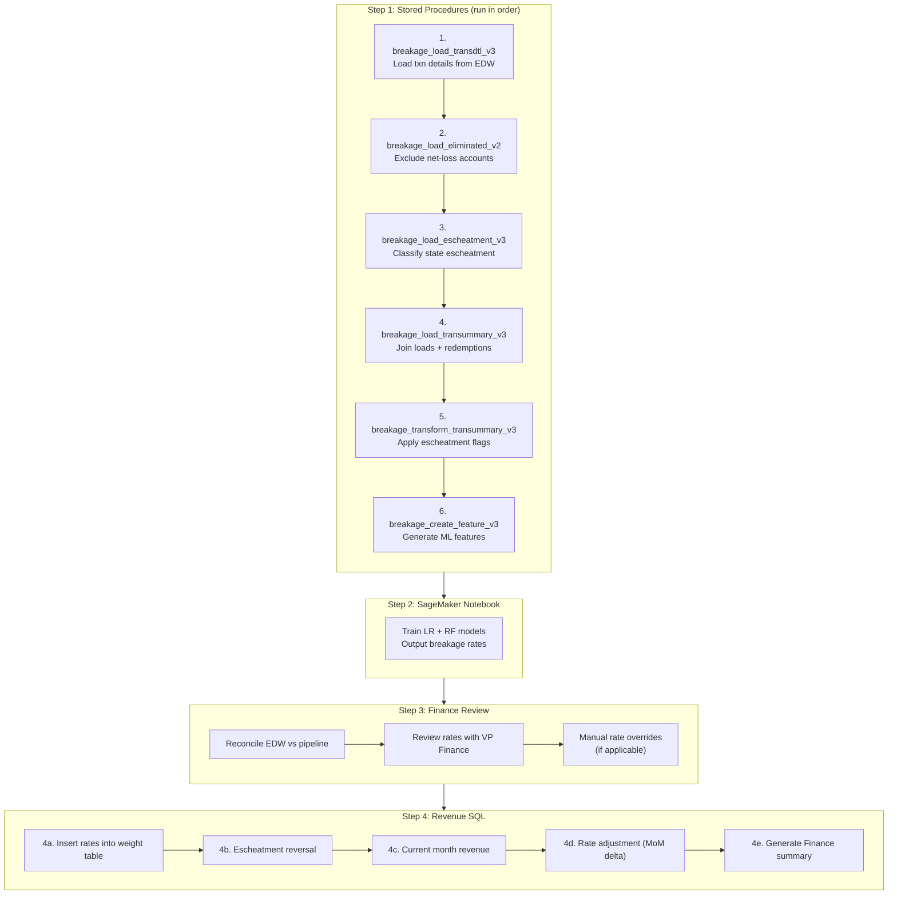

# Execution Runbook

Monthly breakage processing follows a sequential pipeline:





---

## Step 1: Data Load via Stored Procedures (SageMaker/Redshift)

Run the following stored procedures **in order** from the SageMaker notebook. Each procedure accepts `start_date` and `end_date` parameters and returns a row count as status.

| Order | Procedure | Purpose | Example Call |
|-------|-----------|---------|-------------|
| 1 | `breakage_load_transdtl_v3` | Load transaction details from `edw.fct_posted_transaction` for gift cards | `CALL breakage_load_transdtl_v3('2024-09-01', '2024-10-01', 0)` |
| 2 | `breakage_load_eliminated_v2` | Identify accounts with net losses (debit > credit) and exclude from breakage | `CALL breakage_load_eliminated_v2('2024-09-01', '2024-10-01', 0)` |
| 3 | `breakage_load_escheatment_v3` | Classify registered accounts by state escheatment requirements | `CALL breakage_load_escheatment_v3('2024-09-01', '2024-10-01', 0)` |
| 4 | `breakage_load_transummary_v3` | Join loads + redemptions into transaction summary | `CALL breakage_load_transummary_v3('2024-09-01', '2024-10-01', 0)` |
| 5 | `breakage_transform_transummary_v3` | Apply escheatment flags and percentages to summary | `CALL breakage_transform_transummary_v3('2024-09-01', '2024-10-01', 0)` |
| 6 | `breakage_create_feature_v3` | Generate ML features (cumulative redemption % by cohort) | `CALL breakage_create_feature_v3('2024-09-01', '2024-10-01', 0)` |

**Date convention:** `start_date` = first of the reporting month, `end_date` = first of the following month. Example: for September 2024 reporting, use `'2024-09-01'` and `'2024-10-01'`.

### Validation Checks After Step 1

```sql
-- Verify transaction detail loaded
SELECT createdate::date, count(*) FROM datascience.breakage_transdtl_gdbg_v2 GROUP BY 1 ORDER BY 1 DESC LIMIT 5;

-- Verify transaction summary loaded
SELECT createdate::date, count(*) FROM datascience.breakage_transummary_gdbg_v2 GROUP BY 1 ORDER BY 1 DESC LIMIT 5;

-- Verify features created
SELECT reportdate, count(*) FROM datascience.breakage_feature_v3 GROUP BY 1 ORDER BY 1 DESC LIMIT 5;
```

---

## Step 2: Model Inference (SageMaker Notebook)

Run the Jupyter notebook: **`Breakage_Rate_and_Revenue_60months_v3_inference_monthly_retrain(5).ipynb`**

This notebook:
1. Pulls the latest features from `datascience.breakage_feature_v3`
2. Re-trains the Linear Regression model
3. Re-trains the Random Forest model
4. Calculates the 50/50 average of the two models
5. Writes results to:
   - `datascience.breakage_rate_v3_monthly_retrain` (combined)
   - `datascience.breakage_rate_v3_linear_regression_monthly_retrain`
   - `datascience.breakage_rate_v3_random_forest_monthly_retrain`

### Validation Checks After Step 2

```sql
-- Check latest rates from both models
SELECT * FROM datascience.breakage_rate_v3_linear_regression_monthly_retrain
WHERE reportdate = (SELECT max(reportdate) FROM datascience.breakage_rate_v3_linear_regression_monthly_retrain)
ORDER BY 1 DESC, 2 DESC;

SELECT * FROM datascience.breakage_rate_v3_random_forest_monthly_retrain
WHERE reportdate = (SELECT max(reportdate) FROM datascience.breakage_rate_v3_random_forest_monthly_retrain)
ORDER BY 1 DESC, 2 DESC;
```

---

## Step 3: Finance Review (Excel + SQL)

### 3a. Generate Redemption Report

Run `monthly_redemption.sql` to produce the cumulative and monthly redemption analysis by load-date cohort. This output goes into an Excel workbook for review with VP, Finance.

### 3b. Monthly Reconciliation

Run `breakage_monthly_recon_edw_fct_post_to_sagemaker_sp.sql` to reconcile EDW posted transactions against the SageMaker pipeline data. Verify credit/debit totals match.

```sql
-- Expected output: monthly credit/debit totals for gift card transactions
SELECT date_trunc('month', posted_dttm_pt) AS month, credit_or_debit, count(*) AS qty, sum(total_post_amt) AS amt
FROM edw.fct_posted_transaction t
JOIN edw.dim_product p ON t.product_uid = p.product_uid
WHERE p.product_type_uid = 3
  AND posted_dttm_pt >= '2024-09-01' AND posted_dttm_pt < '2024-10-01'
GROUP BY 1, 2 ORDER BY 1, 2;
```

### 3c. Manual Rate Overrides (if applicable)

Finance may override specific cohort rates based on the review. These overrides are applied in Step 4a.

---

## Step 4: Revenue Calculation (SQL)

Run **`breakage_create_acct_rev_v5_revised_model_use5_2024q3.sql`** in sections. This script requires manual date updates (marked with `--UPDATE TO DYNAMIC--` comments).

### 4a. Insert Rates into Weight Table

1. Back up the current rate table
2. Insert new rates (combined 50/50 average, with any manual overrides from Finance)
3. Calculate `rate_adjust` (MoM delta)

**Target table:** `datascience.breakage_rate_v3_as_of_20240101_monthly_retrain_weight`

**Dates to update:**
- `reportdate` filter: current reporting month (e.g., `'2024-09-01'`)
- `weight` label: current quarter (e.g., `'2024Q3'`)
- Prior month for rate_adjust: previous reporting month (e.g., `'2024-08-01'`)

### 4b. Escheatment Reversal (Insert A)

For any **newly registered accounts** in escheatable states this month, reverse historical revenue:

```
reversed_amount = historical_revenue * escheatment_percentage * -1
```

Labeled as `revtype = 'adjustment-escheatment'`.

**Dates to update:** `e.reportdate` range for the current month.

### 4c. Current Month Revenue (Insert B)

For all gift card redemptions in the current month:

```
revenue = redemption_rate * breakage_to_date * (1 - escheatment_pct)
```

- Open period (< 60 months): Revenue recognized proportionally
- Closed period (>= 60 months): Revenue reversed (`revtype = 'adjustment-reverse'`)

**Dates to update:** `redemptiondate` range, `reportdate` range, `weight` label.

### 4d. Rate Adjustment (Insert C)

Calculate the delta between revenue-to-date under prior rates vs. current rates:

```
adjustment = (new_expected_revenue - old_actual_revenue) * (1 - escheatment_pct)
```

Labeled as `revtype = 'adjustment-rate'`.

**Dates to update:** `month_report`, `reportdate` ranges, `weight` label.

### 4e. Generate Finance Summary

Run the final aggregate query to produce the summary shared with Finance/CFO:

```sql
SELECT createdate::date, reportdate::date, loaddate::date, revtype,
       sum(revamt) AS revamt, sum(redemamt) AS redemamt, sum(load_amt) AS load_amt
FROM datascience.breakage_acct_revenue_v5_monthly_retrain_as_of_20240101_2024q1
GROUP BY 1, 2, 3, 4
ORDER BY 1 DESC, 2 DESC, 3 DESC, 4;
```

This output is exported to an Excel workbook with a pivot table for CFO review.

---

## Date Parameters Quick Reference

Each run cycle requires updating dates across multiple scripts. Use this reference:

| Parameter | Format | Example (Sep 2024) |
|-----------|--------|---------------------|
| Reporting month start | `YYYY-MM-01` | `2024-09-01` |
| Reporting month end | `YYYY-MM-01` (next month) | `2024-10-01` |
| Prior month | `YYYY-MM-01` | `2024-08-01` |
| Quarter label | `YYYYQn` | `2024Q3` |
| Escheatment lookback | `start_date` in SP calls | `2024-09-01` |

---

## Quarterly vs. Monthly Cadence

- **Monthly:** Steps 1-3 (data load, model inference, Finance review)
- **Quarterly:** Step 4 (revenue calculation and rate adjustment) -- though rate inserts happen each reporting month, the revenue table and Finance summary are finalized quarterly
