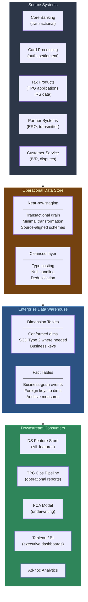

# ODS & EDW Architecture Build

## What I Built

Led the design and implementation of Green Dot's Operational Data Store (ODS) and Enterprise Data Warehouse (EDW) layers on Amazon Redshift. This was the foundational data infrastructure that all downstream analytics, reporting, and ML pipelines depend on — including the [Feature Store](../feature-store/), [FCA Model](../tpg-fca-model/), and [Operations Pipeline](../tpg-operations-pipeline/) documented elsewhere in this portfolio.

## My Role: Technical Lead

I owned the end-to-end build as technical lead:

- **Discovery & mapping:** Ran source-to-ODS and ODS-to-EDW mapping sessions with business and IT stakeholders to define which source system tables feed into which ODS/EDW structures
- **Schema design:** Defined the ODS staging models (transactional grain, near-raw) and EDW conformed dimension/fact tables (business grain, historical)
- **QA oversight:** Managed the QA process — reviewed validation scripts, ensured reconciliation between source → ODS → EDW at row-count, aggregate, and edge-case levels
- **Executive reporting:** Presented migration status, risk items, and timeline to VP and C-level stakeholders using a tracking list I maintained

## Why This Matters

Every data science project starts with "where does the data live and can I trust it?" The ODS/EDW build answered that question for the entire analytics organization. Without reliable, well-documented warehouse layers:

- Feature store queries would hit raw source tables with inconsistent schemas
- ML training data would lack reproducibility guarantees
- Operational reports would each reinvent their own joins and filters

This project gave every downstream consumer — analysts, data scientists, reporting tools — a single source of truth.

## Architecture

## Source-to-ODS-to-EDW Mapping Process

```mermaid
flowchart LR
    subgraph Discovery["1. Discovery"]
        D1["Identify source tables\nand owners"]
        D2["Profile data:\nvolume, grain, freshness"]
    end

    subgraph Mapping["2. Mapping Sessions"]
        M1["Source → ODS:\ncolumn-level mapping\ntype decisions"]
        M2["ODS → EDW:\nbusiness key alignment\ndim vs fact classification"]
    end

    subgraph Build["3. Build & Test"]
        B1["Implement ETL/ELT"]
        B2["Row-count reconciliation\naggregate validation\nedge-case QA"]
    end

    subgraph Deliver["4. Certify & Hand Off"]
        DL1["Document lineage"]
        DL2["Stakeholder sign-off"]
        DL3["Downstream team\nonboarding"]
    end

    Discovery --> Mapping --> Build --> Deliver

    style Discovery fill:#2d3748,stroke:#4a5568,color:#e2e8f0
    style Mapping fill:#744210,stroke:#975a16,color:#fefcbf
    style Build fill:#2c5282,stroke:#2b6cb0,color:#bee3f8
    style Deliver fill:#2f855a,stroke:#38a169,color:#c6f6d5
```

## Key Technical Decisions

<!-- FILL IN: Replace or expand these with your actual decisions -->

1. **ODS as near-raw staging layer:** Kept ODS close to source schema with minimal transformation — type casting, null handling, deduplication. This preserved auditability and made source-change impact analysis straightforward.

2. **EDW conformed dimensions:** Built shared dimension tables (accounts, partners, products, dates) with business keys so fact tables across domains could be joined consistently. Eliminated the "every team has their own account table" problem.

3. **Reconciliation-first QA:** Every ODS and EDW table had row-count and aggregate reconciliation scripts comparing back to source. Mismatches surfaced before any downstream consumer saw the data.

4. **Incremental load strategy:** ODS tables used incremental loads keyed on source timestamps to avoid full-table rescans on the source systems. EDW fact tables used merge/upsert patterns for late-arriving records.

5. **SCD Type 2 for key dimensions:** Slowly-changing dimensions (e.g., partner status, account attributes) tracked with effective date ranges so historical reporting remained accurate even as entities changed.

## QA Framework

| Validation Layer | What It Checks | When It Runs |
|-----------------|----------------|--------------|
| **Source → ODS row counts** | Total rows match between source extract and ODS landing | Every load |
| **ODS → EDW aggregates** | Sum of key measures (amounts, counts) match between ODS and EDW | Every load |
| **Referential integrity** | All fact table foreign keys resolve to valid dimension records | Daily |
| **Freshness monitoring** | Max timestamp in each table vs expected refresh cadence | Continuous |
| **Edge-case spot checks** | Known tricky records (nulls, duplicates, boundary dates) validated | Per release |

## Stakeholder Communication

As technical lead, I managed the communication cadence:

- **Weekly tracking list reviews** with the project team — table-by-table status, blockers, dependencies
- **Bi-weekly executive updates** to VP/C-level — migration progress (% tables complete), risk items, timeline adjustments
- **Discovery sessions** with source system owners — column-level mapping walkthroughs, data quality issue identification
- **Onboarding handoffs** to downstream teams (DS, analytics, BI) once layers were certified

## Impact

- **Foundation for all downstream analytics** — Feature Store, FCA Model, Operations Pipeline, and BI dashboards all query EDW tables
- **Eliminated redundant source access** — teams stopped writing ad-hoc queries against raw production databases
- **Established data trust** — reconciliation framework gave stakeholders confidence in warehouse accuracy
- **Enabled self-service** — conformed dimensions and documented grain made EDW tables accessible to analysts without tribal knowledge

## Technology

- **Platform:** Amazon Redshift
- **ETL/ELT:** dbt, stored procedures
- **Source systems:** Core banking, card processing, tax products (TPG), partner systems, customer service
- **QA:** SQL-based reconciliation scripts, row-count and aggregate validation
- **Tracking:** Migration tracking list with table-level status, owner, and dependency mapping
