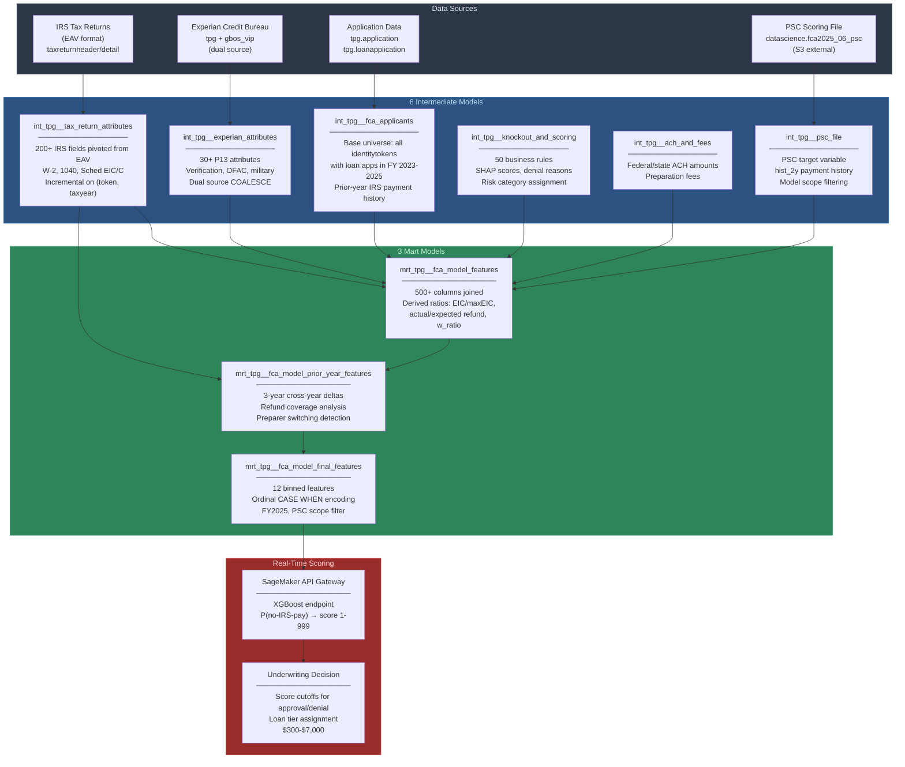
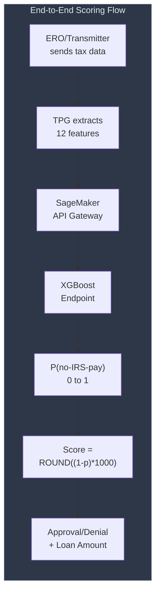

# TPG FCA 2026 Underwriting Model

## What I Built

An end-to-end ML feature engineering and scoring pipeline for SBTPG's FCA (Fast Cash Advance) underwriting model. I extracted ~350 raw features from IRS tax return data, Experian credit bureau responses, and 3 years of filing history, then distilled them to 12 binned features consumed by an XGBoost model deployed on AWS SageMaker. The model predicts the likelihood of insufficient IRS refund ("No-IRS-Pay") for tax-season advance loan applicants.

I built the entire data pipeline in dbt/SQL on Redshift: 6 intermediate models for feature extraction, 3 mart models for feature assembly and binning, plus the Implementation Programming Specifications document shared with Model Risk Management.

## Business Context

SBTPG processes ~20M tax returns annually. For a subset of filers, TPG provides advance loans (FCA, ERA, RA) -- cash before the IRS refund arrives. The risk: if the refund is smaller than expected (IRS offset, partial payment, fraud), the advance isn't fully repaid.

The FCA 2026 model scores each loan application in real time via SageMaker. The ERO/Transmitter sends applicant tax data to TPG, which extracts the 12 features, sends them to the SageMaker API Gateway, and receives a probability (0-1). The final score = `ROUND((1 - probability) * 1000)` (1-999 scale, higher = lower risk).

**Model performance (FCA 2026 vs FCA 2025):**

| Metric | FCA 2026 | FCA 2025 | Lift |
|--------|----------|----------|------|
| KS | 30.4 | 26.5 | +15% |
| AUROC | 0.702 | 0.677 | +4% |
| GINI | 0.404 | 0.354 | +14% |
| No-IRS-Pay captured (worst 10%) | 30.8% | 28.0% | +10% |
| No-IRS-Pay captured (worst 20%) | 47.7% | 42.9% | +11% |

**Training data:** 224,402 records (FCA 2025 applicants), 4.5% No-IRS-Pay rate. XGBoost with Bayesian hyperparameter tuning (100 rounds), sample weighting for class imbalance. 64/16/20 train/test/validation split. Out-of-time validation on FCA 2024 data confirmed no overfitting.

## Architecture

See [architecture.md](architecture.md) for detailed DAGs and materialization strategy.

## The 12 Model Features

These 12 features were selected from ~350 candidates through iterative feature importance analysis, partial dependence plots, and correlation reduction. Each is binned into ordinal integers via SQL CASE WHEN, matching the trained model's expected input format.

| # | Feature | Bins | What It Captures |
|---|---------|------|-----------------|
| 1 | `risk_f` | 5 | 3-year IRS payment history risk factor (from PSC file) |
| 2 | `pct_standard_children` | 6 | % of qualifying children with standard relationships (son/daughter/grandchild) vs non-standard -- fraud signal |
| 3 | `py_rrec_hist` | 3 | Prior-year IRS repayment history: Full (F), Partial (P), None (N) |
| 4 | `cnt_irs1040scheduleeic_qualifyingchildssn` | 4 | Count of distinct qualifying child SSNs on Schedule EIC |
| 5 | `days_from_tax_season_start_date` | 11 | Days between loan application and Jan 2, 2026 (tax season start) |
| 6 | `cnt_irs1040schedulec` | 5 | Count of distinct Schedule C document IDs (self-employment indicator) |
| 7 | `r_actual2expectedirsrefund_prev` | 6 | Ratio of actual/expected IRS refund for TY2024 (separate JH vs non-JH logic) |
| 8 | `r_actual2expectedirsrefund_prev2` | 6 | Same ratio for TY2023 (2-year lookback) |
| 9 | `w_ratio` | 5 | Tax withholding ratio: total withholding / max(total income, wages, withholding) |
| 10 | `irsw2_socialsecuritywagesamount` | 15 | Total W-2 Social Security wages (employment indicator) |
| 11 | `r_eic2expectedirsrefund` | 11 | EIC / expected IRS refund ratio |
| 12 | `r_eic2maxeic` | 8 | EIC utilization: actual EIC / statutory max EIC for qualifying child count |

## Key Technical Decisions

1. **SQL-native feature engineering:** All ~350 features computed in dbt/SQL rather than Python. This keeps the pipeline in a single system, makes features auditable, and eliminates data movement between platforms.

2. **Incremental tax return processing:** `int_tpg__tax_return_attributes` uses `incremental` materialization with compound unique key `(identitytoken, taxyear)`. This handles the 200+ column pivot efficiently -- only new/updated returns are reprocessed.

3. **Binning in SQL, not Python:** The 12 production features are discretized via CASE WHEN in SQL. Fixed bin boundaries match the trained model exactly -- no floating-point drift, no library dependencies, fully auditable.

4. **Three-year lookback design:** The applicant universe spans 3 filing years (2023-2025) to enable prior-year feature computation. Cross-year self-joins produce YoY deltas for EIC, wages, refund coverage, and preparer switching.

5. **JH vs Non-JH branching:** Several features (notably `r_actual2expectedirsrefund_prev`) have different source logic for Jackson Hewitt vs non-JH transmitters. JH uses transmitter-provided prior-year data (`RREC_PY_IRSPAY/REFUND`) while non-JH uses TPG database records.

6. **EIC-aware sentinel values:** Features like `pct_standard_children` use sentinel bin values (1-3) for edge cases (EIC=0 + no dependents, EIC=0 + dependents, EIC>0 + no dependents) rather than treating them as missing data.

## Impact

The FCA 2026 model enables SBTPG to serve ~236K applicants with advance loans ranging from $300 to $7,000 (totaling ~$1.7B in IRS refund exposure). The model's score (1-999) drives both approval/denial cutoffs and loan tier assignment. In backtesting, the worst-scoring 5% had a 17.2% No-IRS-Pay rate vs 1.3% for the best 5% -- a 13x separation. The model outperforms its predecessor (FCA 2025) across all metrics, with a 15% KS lift.

## Technology

- **ML Platform:** AWS SageMaker (XGBoost, real-time endpoint)
- **Feature Pipeline:** dbt on Amazon Redshift
- **Sources:** `greendot.tpg` (80+ tables), `greendot.datascience`, `gbos_vip` (Experian)
- **Scale:** 3 years of filing data, 224K+ applicants, 200+ pivoted IRS attributes, ~350 raw features → 12 production features
- **Stakeholders:** Model Risk Management, Green Dot Bank Tax Refund Product, Risk IT, TPG IT

## Documentation

- [Architecture](architecture.md) -- Pipeline DAG, materialization strategy, filing year scoping
- [Model Catalog](model-catalog.md) -- All 9 data science models with grain and key logic
- [Business Rules](business-rules.md) -- 50 knockout rules, PSC scoring, EIC caps, JH vs non-JH logic
- [Technical Patterns](technical-patterns.md) -- Tax return pivoting, Experian integration, cross-year features, binning
- [LLM Context](llm-context.md) -- AI-readable summary
