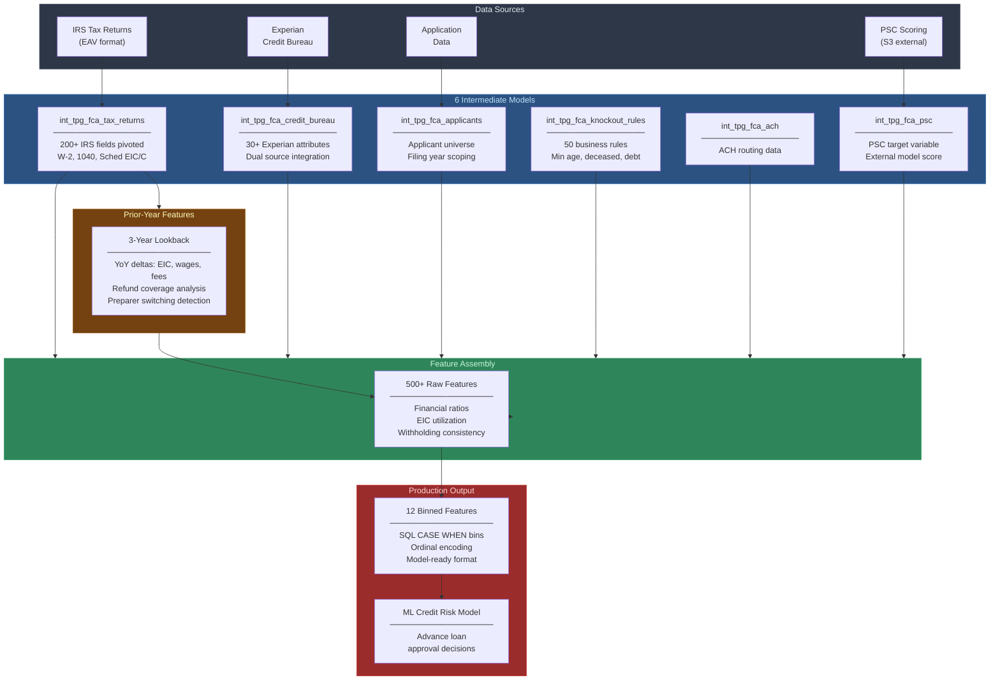
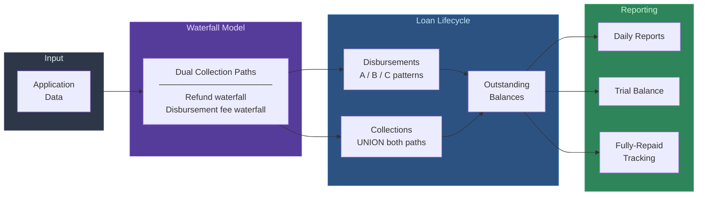

# TPG FCA Credit Risk Model

## What I Built

An end-to-end ML feature engineering pipeline for predicting advance loan losses in SBTPG's tax-season financial products. Built entirely from scratch -- from raw IRS tax return data and Experian credit bureau responses to production-ready binned features consumed by a trained credit risk model.

This project spans two systems:
1. **Credit risk feature pipeline** (data science): 9 dbt models producing 500+ features from IRS data, credit bureau, and 3 years of filing history, distilled to 12 binned features for ML scoring
2. **Advance loan operations** (analytics engineering): 7+ dbt models tracking the full lifecycle of advance loans -- disbursement, daily collections, outstanding balances, and exposure monitoring

## Business Context

SBTPG processes ~20M tax returns annually. For a subset of filers, TPG provides advance loans -- cash before the IRS refund arrives. The risk: if the refund is smaller than expected (IRS offset, partial payment, fraud), the advance isn't fully repaid.

I built the feature pipeline to predict which loans will result in losses, enabling the underwriting team to make better approval decisions.

## Feature Engineering Highlights

- **200+ IRS form field features** pivoted from EAV storage (W-2 wages, 1040 fields, Schedule EIC, Schedule C)
- **30+ Experian credit bureau attributes** integrated from two source systems
- **50 knockout business rules** encoded (minimum age, deceased check, prior-year debt, withholding ratio thresholds)
- **3-year cross-year features:** YoY deltas for EIC, wages, prep fees; refund coverage analysis; preparer switching detection
- **Financial ratios:** EIC utilization (`r_eic2maxeic`), refund accuracy (`r_actual2expectedirsrefund`), withholding consistency (`w_ratio`)
- **12 production-ready binned features** with ordinal bins matching the trained model's expected input format

## Architecture

### Credit Risk Feature Pipeline

### Advance Loan Operations Pipeline

See [architecture.md](architecture.md) for detailed DAGs and waterfall mechanics.

## Key Technical Decisions

1. **SQL-native feature engineering:** All 500+ features computed in dbt/SQL rather than Python. This keeps the pipeline in a single system, makes features auditable, and eliminates data movement between platforms.

2. **Incremental tax return processing:** Tax return attributes use `incremental` materialization with compound unique key `(identitytoken, taxyear)`. This handles the 200+ column pivot efficiently -- only new/updated returns are reprocessed.

3. **Dual collection path handling:** Advance loan collections come from two waterfall sources (refund waterfall + disbursement fee waterfall). Missing either path understates collections by 10-20%. I UNION both sources in `int_tpg_fca_collections`.

4. **Binning in SQL, not Python:** The 12 production features are discretized via CASE WHEN in SQL. Fixed bin boundaries match the trained model exactly -- no floating-point drift, no library dependencies, fully auditable.

5. **Three-year lookback design:** The applicant universe spans 3 filing years (2023-2025) to enable prior-year feature computation. Cross-year self-joins produce YoY deltas for EIC, wages, refund coverage, and preparer switching.

## Impact

The feature pipeline feeds SBTPG's advance loan underwriting decisions. The 12 final features -- spanning prior-year IRS payment history, EIC utilization, filing timing, self-employment indicators, withholding ratios, and refund accuracy -- capture the strongest loss predictors identified during model training.

## Technology

- **Platform:** dbt on Amazon Redshift
- **Sources:** `greendot.tpg` (80+ tables), `greendot.datascience`, `gbos_vip` (Experian)
- **Scale:** 3 years of filing data, all loan applications, 200+ pivoted IRS attributes

## Documentation

- [Architecture](architecture.md) -- Three waterfall systems, dual DAGs, filing year scoping
- [Model Catalog](model-catalog.md) -- All 15 models with grain and key logic
- [Business Rules](business-rules.md) -- Waterfall mechanics, 50 knockout rules, PSC scoring, EIC caps
- [Technical Patterns](technical-patterns.md) -- Tax return pivoting, Experian integration, cross-year features, binning
- [LLM Context](llm-context.md) -- AI-readable summary
