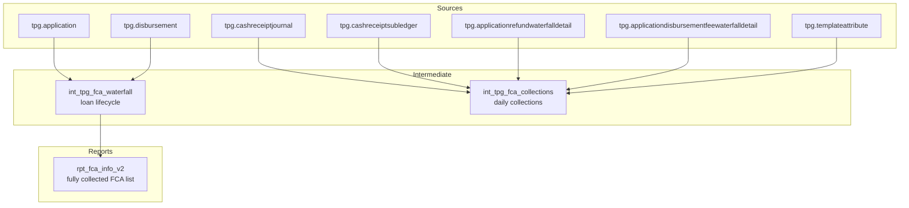

# TPG FCA Model — Architecture

## Overview

The FCA pipeline produces two primary analytic surfaces:

1. **Loan-level lifecycle** (one row per FCA loan/application)
2. **Daily collections** (multiple rows per loan across dates, for monitoring and trend analysis)



## Core Concepts

### 1) Grain and Keys

| Entity | Grain | Key |
|--------|-------|-----|
| Loan / FCA agreement | One row per loan | `applicationkey` |
| Collections | Multiple rows per loan | `applicationkey + collection_date (+ attribute)` |

### 2) Dual Waterfall Collection Sources

Collections are derived from two waterfall detail sources:

- **Refund Waterfall**
  - Tracks how refund money is applied (principal, interest)
- **Disbursement Fee Waterfall**
  - Tracks fee-based flows that also contribute to collections

In both cases, collections are mapped to:
- **Principal** vs **Interest** using `TemplateAttributeKey`

### 3) Principal vs Interest Classification

TemplateAttributeKey mapping (business rule):
- `1` = **Principal**
- `2` = **Interest**

This mapping is critical because it drives:
- principal collected totals
- interest collected totals
- repayment status logic

## Collections Join Pattern (High level)

The collections model follows this conceptual join:

```text
cashreceiptjournal
  → cashreceiptsubledger
    → (refundwaterfalldetail OR disbursementfeewaterfalldetail)
      → templateattribute (principal vs interest)
```

Key filters:
- `journaltransactiontypekey IN (1,2)` for “normal collections”
- `isactive = 1` for the detail tables

## Determining collection_date

Collection date is defined to be operationally meaningful:

- Prefer `cashreceiptjournal.processdate`
- Else: `effective_date - 1 day`

Reason: some source records may not have a process date populated, but effective date exists.

## Data Products

### `int_tpg_fca_waterfall` (loan lifecycle)
- One row per `applicationkey`
- Captures:
  - funding date
  - principal/interest owed
  - principal/interest collected
  - repayment date
  - disbursement method
  - filing year attributes for scoping and reporting

### `int_tpg_fca_collections` (daily collections)
- Multiple rows per `applicationkey`
- Captures:
  - `collection_date`
  - principal collected amount
  - interest collected amount
  - transmitter/master/efin for slicing monitoring by partner hierarchy

### `rpt_fca_info_v2` (fully collected)
- Business filter: `principal_collected = principal_owed`
- Filing-year scoped via dbt `var('filing_year')`
