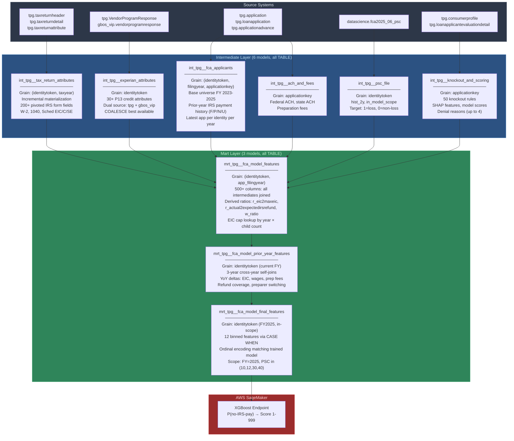

# TPG FCA Model Architecture

## Overview

This is a credit risk feature engineering pipeline built in dbt on Redshift for SBTPG's FCA 2026 Underwriting Model. It extracts ~350 raw features from IRS tax return data, Experian credit bureau responses, application data, and prior-year filing history, then distills them into 12 binned features consumed by an XGBoost model deployed on AWS SageMaker.

I designed the architecture, built all 9 dbt models, wrote the Implementation Programming Specifications, and co-authored the Final Model Documentation with the Head of Tax Refund.

## Business Context

SBTPG provides advance loans (FCA, ERA, RA) to taxpayers before their IRS refund arrives. The core risk: if the refund is smaller than expected, the loan isn't fully repaid.

**Products and template attribute keys:**

| Product | Timing | Principal Key | Interest Key |
|---------|--------|--------------|-------------|
| FCA (Funded Cash Advance) | Post-ACK | 1 | 2 |
| ERA (Early Refund Advance) | Pre-ACK | 142 | 143 |
| RA (Refund Advance) | Variable | 144 | 145 |

**Target variable definition:**
- **1 (Bad/No-IRS-Pay):** PSC 30 or 40 -- expected refund < 40% of actual refund
- **0 (Good/Full-IRS-Pay):** PSC 10 or 12 -- expected refund >= 90% of actual refund
- **Model scope:** PSC in (10, 12, 30, 40) AND denial_cat in (0, 1)

## Pipeline DAG

## Materialization Strategy

| Model | Strategy | Rationale |
|-------|----------|-----------|
| All intermediates (except tax returns) | `table` with `grant select on {{ this }} to public` | Pre-compute for wide downstream joins; public access for analytics team |
| `int_tpg__tax_return_attributes` | `incremental` (unique_key: identitytoken + taxyear) | Largest dataset (200+ columns × millions of rows), avoids full recompute |
| Feature assembly marts | `table` | 500+ column joins need materialized intermediate results |
| `mrt_tpg__fca_model_final_features` | `table` | Production model input; must be deterministic and auditable |

## Filing Year Scoping

| Scope | Years | Rationale |
|-------|-------|-----------|
| Applicant universe | FY 2023, 2024, 2025 | 3-year window for prior-year feature lookback |
| Tax return attributes | All years matching applicant universe | Tax return joined with 1-year lag (filingyear - 1 = taxyear) |
| Cross-year features | FY 2023 vs 2024 vs 2025 | YoY deltas require all 3 years |
| Final feature output | FY 2025 only | Production model scored for current season |

Key convention: Filing Year 2026 = Tax Year 2025 (returns filed in early 2026 for income earned in 2025).

## Real-Time Scoring Flow

The score drives two downstream decisions:
1. **Approval/Denial:** Score cutoffs determine which applicants are approved. In simulation, the profitability crossover from denial to approval occurs around score 273.
2. **Loan tier assignment:** Approved applicants are assigned loan amounts ($300-$7,000) based on score band and expected refund range. Higher scores qualify for larger loans.
