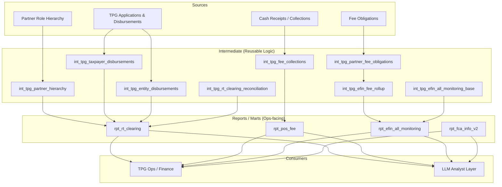

# TPG Operations Pipeline

## Summary

The **TPG Operations Pipeline** is a dbt-based operational analytics system supporting tax product operations. It consolidates fragmented, freeform SQL + legacy reporting logic into a modular, testable set of dbt models and report-ready marts.

This portfolio write-up covers **the full transition**:
1. **Freeform SQL / legacy scripts → dbt models**
2. **QA + reconciliation** to ensure parity and correctness
3. **Lineage + documentation** so the system is maintainable
4. **LLM analyst readiness** so ops users can query in natural language

## My Role: Built from scratch

I built the TPG Operations pipeline from scratch in dbt, including:
- translating legacy/freeform SQL into layered dbt models (intermediate + marts)
- implementing QA/reconciliation patterns to validate correctness
- designing shared canonical logic (partner hierarchy, disbursement selection, fee rollups)
- documenting lineage and common operational workflows
- designing the foundation for an **LLM-powered operations analyst** on top of curated dbt outputs

---

## The Modernization Story (Freeform SQL → dbt)

### Before
- Business-critical queries lived in:
  - MicroStrategy scripts (Script 03/07/08/13/14/16, etc.)
  - ad-hoc SQL snippets
  - manual reconciliations
- Problems:
  - duplicated logic and inconsistent definitions
  - hard to validate / hard to test
  - hard to onboard new analysts
  - difficult to add new reporting without copying SQL

### After
- Layered dbt models:
  - `int_tpg_*` for reusable domain logic
  - `rpt_*` for report-ready operational surfaces
- Benefits:
  - consistent definitions
  - testable transformations (schema tests, uniqueness, not-null expectations)
  - built-in lineage graphs for debugging and onboarding
  - clear “question → model” mapping that enables LLM-assisted analytics

---

## Architecture (High level)

---

## Key Outputs (Ops-ready)

| Output | Model | Primary Audience | Example Questions |
|--------|-------|------------------|------------------|
| RT clearing reconciliation | `rpt_rt_clearing` | Ops + finance | “Why is this pending?”, “What reason code?” |
| POS fee reporting | `rpt_pos_fee` | Ops | “How much POS fee was collected?” |
| EFIN monitoring | `rpt_efin_all_monitoring` | Ops + compliance | “Which EFINs have high pending fees?” |
| Fully collected FCA list | `rpt_fca_info_v2` | FCA ops | “How many FCAs are fully collected?” |

---

## QA & Reconciliation Approach

### 1) Parity checks vs legacy outputs
During migration, I validated dbt outputs against legacy/freeform SQL by:
- matching record counts and key-level coverage
- reconciling sums for critical measures (amounts, counts)
- comparing sampled keys (e.g., applications/EFINs) for row-level parity

### 2) “Grain-first” validation
Every model begins with an explicit grain decision:
- Application-level (`applicationkey`) vs daily/event-level vs EFIN-level
This prevents silent duplication caused by incorrect join paths.

### 3) Schema + integrity tests
Where applicable, enforce:
- `unique` + `not_null` on primary keys
- required fields not null (dates, keys, reason codes)
- basic referential integrity expectations (where feasible)

> Even when you can’t add exhaustive tests, documenting the intended invariants is extremely helpful for correctness and onboarding.

---

## Lineage & Maintainability

dbt provides:
- model-level lineage graphs to trace where a number came from
- documentation blocks for business definitions
- a standardized workflow for future enhancements

In this pipeline, the design emphasizes:
- shared intermediate models (single source of truth)
- thin report models (no duplicated business logic)
- documentation that maps operational questions to curated surfaces

---

## LLM Analyst Readiness

The same discipline that makes dbt maintainable also makes it LLM-ready:
- stable, documented model surfaces (`rpt_*`)
- consistent grains + keys
- domain glossary + “question routing”
- explicit filing-year/date assumptions

I designed this pipeline so an LLM analyst can:
1. classify the question (fees? RT clearing? monitoring?)
2. route to the correct `rpt_*` model
3. generate transparent SQL
4. return answers with source model references and assumptions

See:
- [LLM Analyst Design](llm-analyst-design.md)
- [LLM Context](llm-context.md)

---

## Documentation

- [Architecture](architecture.md)
- [Model Catalog](model-catalog.md)
- [Legacy Migration Map](legacy-migration-map.md)
- [LLM Analyst Design](llm-analyst-design.md)
- [LLM Context](llm-context.md)
