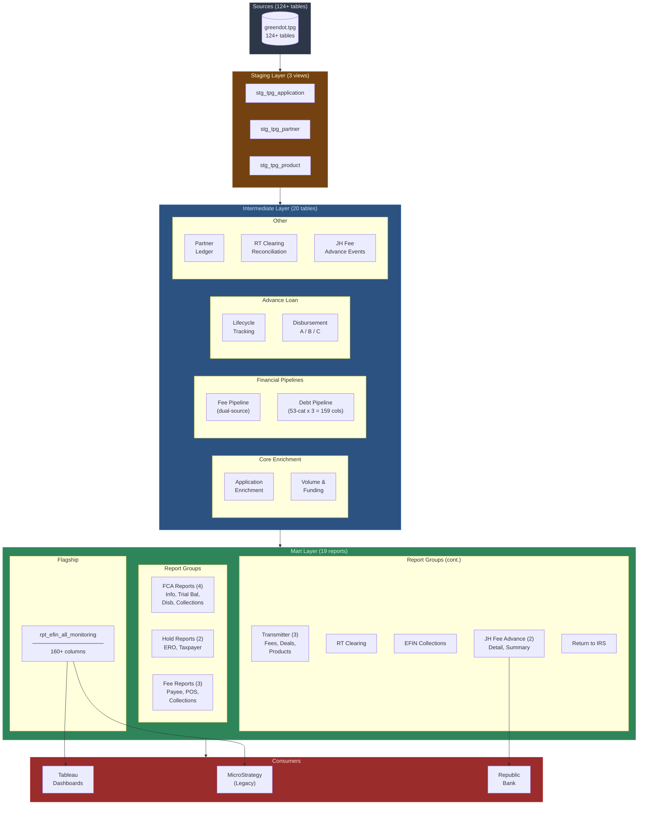
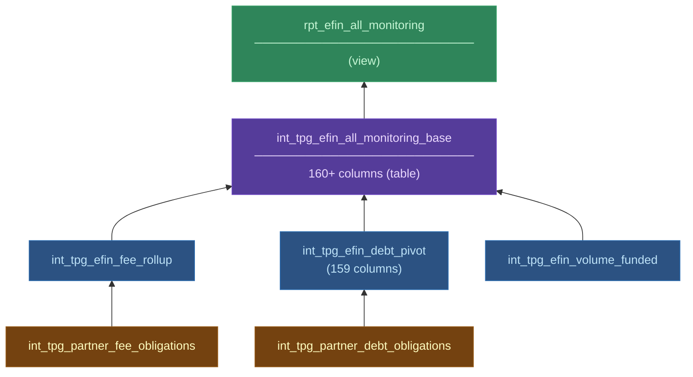
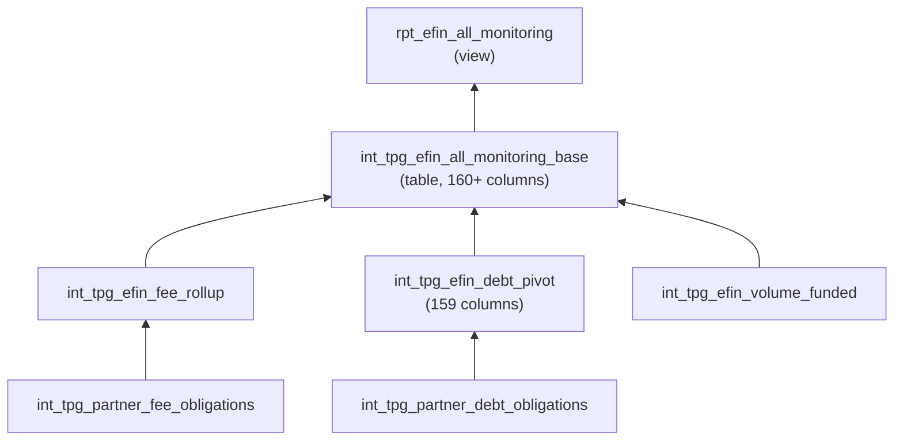

# TPG Operations Pipeline -- Legacy to Modern

## What I Built

I migrated SBTPG's entire operational reporting suite from 19+ monolithic MicroStrategy freeform SQL scripts to a modular dbt pipeline on Redshift. Built everything from scratch: 3 staging models, 20 intermediate models, 19 mart reports, a column-level audit framework, and comprehensive documentation.

This wasn't a lift-and-shift. I decomposed the legacy scripts into reusable intermediate models, identified shared logic that was copy-pasted across scripts, built a proper layered architecture, and added 4 new reports that had no legacy equivalent.

## Scale

- **124+ source tables** from `greendot.tpg`
- **42 dbt models** (3 staging + 20 intermediate + 19 marts)
- **19+ legacy scripts migrated** with column-level audit validation
- **4 new reports** built from scratch (JH Fee Advance detail/summary, EFIN Collections, Return to IRS)
- **160+ column flagship report** (`rpt_efin_all_monitoring`)
- **159-column debt pivot** (53 categories x 3 fields)
- **600-line business context document** written for onboarding

## Architecture

### Flagship Report Dependency Chain

See [architecture.md](architecture.md) for detailed diagrams and dependency chains.

## Key Technical Achievements

### 1. Decomposed Monolithic Scripts into Composable Models

The legacy EFIN All Monitoring script was 500+ lines of SQL with no shared logic. I decomposed it into 6 models:

Each intermediate model is independently testable and reused by multiple mart reports.

### 2. Column-Level Audit Framework

I built a Jinja-based audit model (`audit_rpt_efin_all_monitoring.sql`) that compares ~130+ columns between the legacy source-of-truth and the new dbt output. It produces `match_pct` per column, sorted worst-first, so mismatches surface immediately.

### 3. Dual Fee Source Normalization

Fee data comes from two waterfall families (refund waterfall + disbursement fee waterfall). The legacy scripts handled this inconsistently. I normalized both into `int_tpg_partner_fee_obligations` with standardized payee roles, ensuring all downstream reports use the same fee logic.

### 4. 159-Column Debt Pivot

Partner debts span 53 categories, each with 3 fields (amount, amountcollected, balancedue). I pivot this from long format to 159 wide columns in `int_tpg_efin_debt_pivot`, matching the exact column names the legacy MicroStrategy report expects.

### 5. Seed-Based Transmitter Classification

Transmitter deals require matching combinations of transmitter name, product code, sub-product, and disbursement method to reporting categories. I externalized the ~35 matching rules into a CSV seed file (`ref_transmitter_reporting_product_logic`), so business users can update classifications without touching SQL.

### 6. JH Fee Advance (New Capability)

Built entirely new reporting for Jackson Hewitt P-Center fee advances, combining 3 data sources (CAP limits, advance disbursements, collection waterfall repayments) into daily running balance reports consumed by Republic Bank. Includes a 641-line reference document with raw SQL, validation queries, domain glossary, and risk log.

## Legacy Migration Map

| Script | Legacy Name | dbt Replacement |
|--------|------------|-----------------|
| 01 | EFIN All Monitoring | `rpt_efin_all_monitoring` |
| 02 | ERO Holds | `rpt_ero_holds` |
| 03 | FCA Info V2 | `rpt_fca_info_v2` |
| 05-08 | FCA Trial Balance, Disbursements, Collections | `rpt_fcb_*` (4 reports) |
| 10-12 | Transmitter Fees, Deals | `rpt_transmitter_*` (3 reports) |
| 13 | RT Clearing | `rpt_rt_clearing` |
| 14 | Taxpayer Holds | `rpt_taxpayer_holds` |
| 15-17 | Fee by Payee, POS | `rpt_*_fee*` (3 reports) |
| 19 | Fee Collections | `int_tpg_fee_collections` |

See [legacy-migration-map.md](legacy-migration-map.md) for the full mapping with migration notes.

## Technology

- **Platform:** dbt on Amazon Redshift
- **Source system:** `greendot.tpg` (SBTPG production database, 124+ tables)
- **Consumers:** Tableau dashboards, MicroStrategy (legacy), Republic Bank
- **PII:** Encrypted contact info decrypted via `pdr_stg.decryptaes()` in mart reports

## Documentation

- [Architecture](architecture.md) -- Three-layer design, flagship report dependency chain
- [Model Catalog](model-catalog.md) -- All 42 models with grain and descriptions
- [Legacy Migration Map](legacy-migration-map.md) -- Script-to-model mapping with migration notes
- [LLM Analyst Design](llm-analyst-design.md) -- Vision for natural language querying of TPG ops data
- [LLM Context](llm-context.md) -- AI-readable summary
