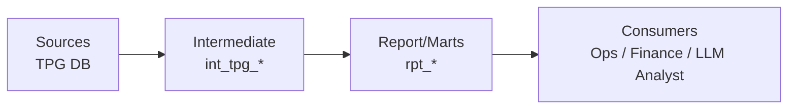
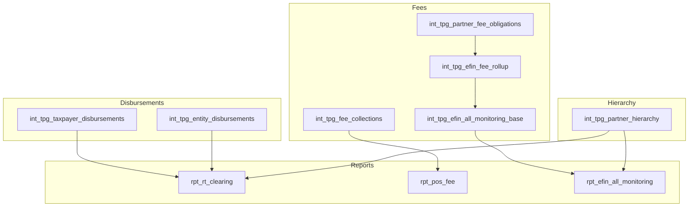

# TPG Operations Pipeline — Architecture

## Purpose

This pipeline converts legacy operational reporting into a maintainable dbt architecture:
- **Intermediate models** hold reusable, well-defined business logic
- **Report models** provide curated, ops-friendly outputs
- The structure is intentionally designed to support an **LLM-assisted analyst layer** on top of canonical models

---

## Layering

### Why this layering matters
- It prevents copy/paste logic between reports
- It makes QA possible (test intermediate logic once, reuse everywhere)
- It produces stable, documented “semantic-ish” surfaces suitable for LLM routing

---

## Core Domain Foundations

### 1) Partner hierarchy as shared foundation

Partner hierarchy is referenced across many reports and must be computed once and reused.

**Model:** `int_tpg_partner_hierarchy`

**Conceptual outputs:**
- `ero_efin`
- `masterefin`
- `transmitterefin`
- `servicebureau_efin`

This model acts like a reusable dimension for slicing operational outputs.

---

### 2) Disbursement surfaces: taxpayer vs entity

Operational reporting uses two disbursement “surfaces”:

| Flow | Model | Why it exists |
|------|-------|---------------|
| Taxpayer disbursements | `int_tpg_taxpayer_disbursements` | The “customer payout” view used for holds and status tracking |
| Entity disbursements | `int_tpg_entity_disbursements` | Partner splits and non-taxpayer payout flows |

These both feed RT clearing.

---

### 3) RT clearing: unioned reconciliation output

RT clearing combines:
- **APPS** (funding reconciliation / application-level issues)
- **DISB** (pending disbursements)
  - taxpayer pending disbursements
  - entity pending disbursements

**Report model:** `rpt_rt_clearing`

This structure supports real ops workflows: a queue of items to resolve, with reason codes and ownership slicing.

---

### 4) Fee monitoring and collections

Fees appear in multiple operational contexts:
- fee obligations (what should be paid)
- fee collections (what has been collected)
- EFIN monitoring rollups (KPIs and ratios)

Intermediate:
- `int_tpg_partner_fee_obligations`
- `int_tpg_fee_collections`
- `int_tpg_efin_fee_rollup`
- `int_tpg_efin_all_monitoring_base`

Reports:
- `rpt_pos_fee`
- `rpt_efin_all_monitoring`

---

## End-to-End Data Flow

---

## QA & Lineage Hooks (Architectural)

To make modernization safe, the architecture is designed to support:
- **reconciliation queries** at intermediate layers
- **grain-level invariants** (documented and testable)
- **lineage tracing** when ops asks “where did this number come from?”

Even without sharing proprietary SQL, the most important design is:
- stable intermediate “business logic” nodes
- thin report nodes that are easy to audit

---

## LLM-readiness by design

This pipeline becomes LLM-ready when:
- every report model is documented with grain + join keys
- model catalog provides routing (question → model)
- llm-context provides a glossary and output requirements (SQL shown, assumptions stated)
